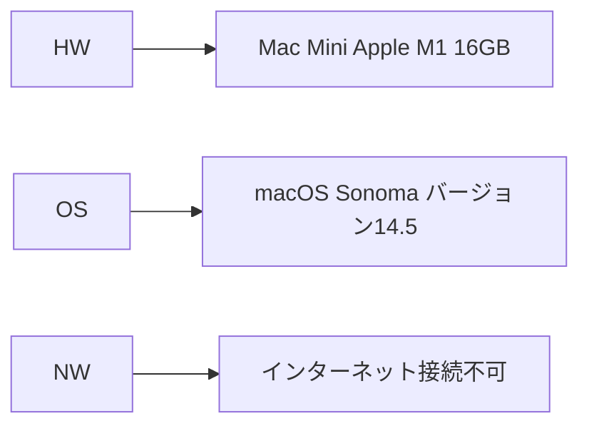
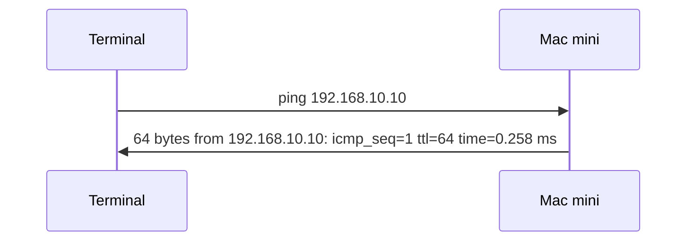

# doc_genai_Using_Generative_AI_with_Mac_Mini_M1_-Server_Setup-
Mac Mini M1 での生成AI活用（サーバセットアップ編）

## 目次
- [はじめに](#はじめに)
- [前提](#前提)
- [固定IPアドレス設定](#固定IPアドレス設定)
- [pingでの疎通確認](#pingでの疎通確認)
- [Mac miniをファイルサーバーとして設定する手順](#Mac-miniをファイルサーバーとして設定する手順)
- [WindowsからMac miniにファイルサーバーとして接続する手順](#WindowsからMac-miniにファイルサーバーとして接続する手順)
- [MacからWindowsの共有フォルダにアクセスする方法](#MacからWindowsの共有フォルダにアクセスする方法)
- [WindowsからMacへリモートデスクトップ接続の手順](#WindowsからMacへリモートデスクトップ接続の手順)
- [Teraterm設定](#Teraterm設定)

## はじめに
当ドキュメントは、Mac Mini M1 を利用した生成AIの活用を目的とした内容のうち、Mac Mini M1 を初期セットアップ状態からサーバとしてセットアップするまでの手順について示しています。


<br/><br/>
<br/><br/>


## 前提
### 当セットアップ手順の前提

* **HW** . . . HWは前提として「Mac Mini Apple M1 16GB」としています。ご利用の環境に応じて読み替えてください。
* **OS** . . . OSは前提として「macOS Sonoma バージョン14.5」としています。ご利用の環境に応じて読み替えてください。
* **NW** . . . NWは前提として「インターネット接続不可」としています。生成AIの環境を閉じたネットワーク内で構築することで安全に利用することを目的としています。


### Mac Mini セットアップに必要な部品

* **有線マウス** 
* **有線キーボード**
* **LANケーブル**
* **ディスプレイ** (HDMI対応が望ましいが、変換アダプタで対応可能)
* **HDMIケーブル** (必要であれば変換アダプタ)

<br/><br/>
**補足:**

* 無線デバイスを使用する場合は、BluetoothレシーバーやUSBドングルが必要になる場合があります。
* ディスプレイの接続には、ディスプレイの端子とMac miniの端子が一致するケーブルが必要です。

<br/><br/>
### 初期セットアップ手順 (大まか)

1. **Mac mini本体に電源ケーブルを接続し、コンセントに差し込む。**
2. **ディスプレイをMac miniに接続する。**
   * HDMIケーブルを使用し、ディスプレイのHDMI端子とMac miniのHDMI端子を接続します。
   * 他の端子を使用する場合は、適切な変換アダプタを使用します。
3. **キーボードとマウスをMac miniに接続する。**
   * USBケーブルを使用し、キーボードとマウスをMac miniのUSBポートに接続します。
4. **電源を入れる。**
   * Mac mini本体の電源ボタンを押します。
5. **初期設定を行う。**
   * 画面の指示に従い、言語設定、Apple ID サインインではなく、ローカルアカウントでログインする設定など、初期設定を行います。

**詳細な手順は、Appleの公式サイトやMac miniに付属のマニュアルをご確認ください。**

<br/><br/>
**注意:**

* 上記は一般的なセットアップ手順であり、モデルや環境によって異なる場合があります。
* Mac miniの電源を入れる前に、すべてのケーブルが正しく接続されていることを確認してください。

**この情報がMac miniのセットアップにお役立ていただければ幸いです。**




<br/><br/>
<br/><br/>


## 固定IPアドレス設定
### Mac miniのIPアドレスを固定する方法

#### 手順

1. **システム設定を開く:** Appleメニューから「システム設定」を選択。
2. **ネットワークを選択:** 「ネットワーク」をクリック。
3. **接続を選択:** 使用しているネットワーク接続（Ethernet）を選択し、「詳細」をクリック。
4. **TCP/IPタブを選択:** 「TCP/IP」タブをクリック。
5. **IPv4の構成を変更:** IPv4の構成を「手動」に変更。
6. **IPアドレスを入力:** 任意のIPアドレスを入力（例：192.168.10.10）。
7. **IPv6の構成を変更:** IPv6の構成を「リンクローカルのみ」に変更。
8. **適用:** 設定を適用。

<br/><br/>
#### 注意点
* **IPアドレスの重複:** 他の機器とIPアドレスが重複しないように注意。
* **サブネットマスク:** サブネットマスクも適切に設定する必要がある場合がある。

<br/><br/>
#### 追加情報
* **動的IPアドレス:** 以前割り当てられていた動的IPアドレスをそのまま固定しても問題ない。
* **Mac miniのモデル:** 2018年、2020年モデルなど、どのモデルでも手順は基本的に同じ。

<br/><br/>
**補足:** 
* この手順は、一般的なMac miniのIPアドレス固定方法です。ネットワーク環境によっては、若干異なる場合があります。
* より詳細な設定やトラブルシューティングについては、Appleの公式サポートページやマニュアルを参照してください。


<br/><br/>
<br/><br/>


## pingでの疎通確認

### pingコマンドを使用して固定したIPアドレスへの接続を確認

上記の手順に続き、pingコマンドを使用して固定したIPアドレスへの接続を確認する方法を解説します。

**1. ターミナルを開く:**
   Mac Mini 以外の同ネットワーク上の端末から、ターミナル（Windowsの場合はコマンドプロンプト）を開きます。

<br/><br/>
**2. pingコマンドを実行:**
   * ターミナルに以下のコマンドを入力し、Enterキーを押します。
     ```bash
     ping 192.168.10.10
     ```
     * 192.168.10.10の部分は、あなたが設定したIPアドレスに置き換えてください。

<br/><br/>
**3. 結果を確認:**
   * コマンドを実行すると、指定したIPアドレスへのパケットの送受信状況が表示されます。
     * 「64 bytes from 192.168.10.10: icmp_seq=1 ttl=64 time=0.258 ms」のようなメッセージが表示されれば、正常に通信できていることを意味します。
     * 途中で中止したい場合は、Ctrl+Cを押します。

<br/><br/>
### pingコマンドについて

* **ping:** ネットワーク上の他のホストにICMP echoリクエストを送信し、応答を受信することで、そのホストへの接続が確立されているかどうかを確認するコマンドです。
* **-t:** pingを継続的に実行し続けるオプションです。

<br/><br/>
### 疎通確認の重要性

* **設定の確認:** IPアドレスが正しく設定され、ネットワークに接続されていることを確認できます。
* **トラブルシューティング:** ネットワーク接続に問題が発生した場合、pingコマンドで原因を特定する手がかりを得ることができます。

<br/><br/>
### その他の注意点

* **ファイアウォール:** ファイアウォール設定によっては、pingの応答がブロックされる場合があります。
* **ネットワーク環境:** ネットワークの構成や設定によって、pingの結果が異なる場合があります。
* **IPアドレスの範囲:** 使用できるIPアドレスの範囲は、ネットワーク環境によって異なります。

<br/><br/>
### まとめ

Mac miniのIPアドレスを固定し、pingコマンドで疎通確認を行うことで、安定したネットワーク環境を構築することができます。上記の手順を参考に、ご自身の環境に合わせて設定を行ってください。

<br/><br/>
**補足:**
* より詳細なpingコマンドのオプションについては、ターミナルで「man ping」と入力してマニュアルを参照してください。
* ネットワークに関するトラブルシューティングは、専門的な知識が必要な場合があります。ご自身で解決できない場合は、ネットワーク管理者やITサポートに相談することをおすすめします。




<br/><br/>
<br/><br/>

## Mac miniをファイルサーバーとして設定する手順

### Mac mini側（サーバー側）
1. **ファイル共有を有効にする:**
   - システム設定 > 一般 > 共有を開き、「ファイル共有」にチェックを入れる。
   - 「i」（詳細設定）を開く。
   - 「オプション」より「Windows ファイル共有」を「オン」に設定する。
   - 必要に応じて共有したいフォルダを「+」ボタンで追加する。（デフォルトでローカルアカウントのユーザフォルダが共有設定される）
   - コンピュータ名を変更する（任意）。

<br/><br/>
**補足:**
* **IPアドレス:** Mac miniの固定IPアドレスを事前に設定しておくことをおすすめします。
* **SMBプロトコル:** 上記の手順ではSMBプロトコルを使用しています。
* **セキュリティ:** ファイル共有の設定によっては、セキュリティリスクが高まる可能性があります。必要に応じて、適切なアクセス権限を設定してください。


<br/><br/>
<br/><br/>


## WindowsからMac miniにファイルサーバーとして接続する手順

### Windows側の設定

**1. サーバーアドレスの確認:**
   * Mac miniのIPアドレスを確認します。ネットワーク設定やルーターの設定画面から調べることができます。

<br/><br/>
**2. Windowsエクスプローラーを開く:**
   * Windowsのスタートメニューから「ファイルエクスプローラー」を起動します。

<br/><br/>
**4. Mac miniに接続:**
   * アドレスバーに「\\192.168.10.10」などと入力しエンター。
   * 接続を求めるダイアログが表示されたら、Mac miniのユーザー名とパスワードを入力して接続します。

<br/><br/>
### 接続できない場合の対処法

* **SMBプロトコル:**
   * WindowsではSMBプロトコルでMacに接続するのが一般的です。Windowsの機能でSMBが有効になっているか確認しましょう。
   * Windowsの「コントロールパネル」→「プログラムと機能」→「Windowsの機能の有効化または無効化」から「SMB 1.0/CIFS ファイル共有サポート」にチェックが入っているか確認します。
* **ファイアウォール:**
   * Windowsのファイアウォールやセキュリティソフトが接続をブロックしている可能性があります。一時的にファイアウォールを無効にして試してみましょう。
* **ユーザーアカウント:**
   * Mac miniの共有設定で、Windowsからの接続を許可するユーザーアカウントを作成しているか確認します。
* **IPアドレス:**
   * Mac miniのIPアドレスが固定されているか確認します。DHCPで自動取得している場合は、毎回IPアドレスが変わる可能性があります。
* **ワークグループ:**
   * Mac miniとWindowsが同じワークグループに属しているか確認します。

<br/><br/>
### その他

* **Windows 10以降:**
   * Windows 10以降では、ホームグループという機能が利用できます。ホームグループを設定することで、より簡単にネットワーク内のPCとファイルを共有できます。
* **サードパーティ製のファイル共有ソフト:**
   * WindowsとMac間のファイル共有を専門とするサードパーティ製のソフトウェアを利用することもできます。

<br/><br/>
**注意:**
* セキュリティ上の理由から、共有設定は慎重に行いましょう。
* パスワードは定期的に変更し、複雑なパスワードを設定することをおすすめします。

<br/><br/>
**補足:**
* 上記の手順は一般的な手順であり、環境によっては異なる場合があります。
* 接続できない場合、より詳細な情報（エラーメッセージなど）があると、より的確なアドバイスができます。

**もし、さらに詳しい情報が必要な場合は、お気軽にご質問ください。**


<br/><br/>
<br/><br/>

## MacからWindowsの共有フォルダにアクセスする方法

### Windows側の設定
1. 共有したいフォルダを右クリックし、「プロパティ」を選択。
2. 「共有」タブをクリックし、「共有」ボタンを押します。
3. 「ネットワークアクセス」パネルで「Everyone」を選択し、「読み取り/書き込み」を設定。
4. 「詳細な共有」タブで「このフォルダーを共有する」にチェックを入れ、「アクセス許可」で「フルコントロール」を選択。

### Mac側の設定
1. Finderのメニューバーから「移動」→「サーバへ接続」を選択（ショートカット：command + K）。
2. 「サーバアドレス」フィールドに `smb://<WindowsのIPアドレス>` を入力し、「接続」をクリック。
3. Windowsのユーザー名とパスワードを入力し、共有フォルダを選択。

これで、MacからWindowsの共有フォルダにアクセスできるようになります。


<br/><br/>
<br/><br/>

## WindowsからMacへリモートデスクトップ接続の手順

### Mac側の設定
1. **画面共有を有効にする:** システム設定 > 共有 で「画面共有」をオンにし、パスワードを設定する。
2. **VNCの使用を許可する:** 「VNC使用者が画面を操作することを許可」にチェックを入れ、パスワードを設定する。（パスワードはローカルアカウントのパスワードと同じパスワードを設定しておけばよい）
3. **アクセスを許可:** 「アクセスを許可」の「+」ボタンより、ローカルアカウントのユーザ名を選択し、追加する。

<br/><br/>
### Windows側の準備
1. **RealVNC Viewerをダウンロード・配置する:** RealVNCの公式サイトから「Standalone Exe x64」を選択のうえダウンロードし、任意の場所へ配置する。
2. **Macに接続する:** VNC Viewerを起動し、初回起動時は「use realvnc without account」を選択し、MacのIPアドレスを入力して接続する。
3. **認証:** Macのログイン情報（Mac側の設定で追加したユーザと、そのユーザのパスワード）を入力して認証する。

<br/><br/>
**補足:**
* **IPアドレスの固定:** 頻繁に接続する場合、IPアドレスが変更されないよう固定設定を行うと便利。
* **セキュリティ:** アクセス制限を厳しく設定し、セキュリティに配慮する。

<br/><br/>
**その他:**
* **VNCとは:** Virtual Network Computingの略で、画面共有のためのプロトコル。
* **マイクロソフトのリモートデスクトップ:** WindowsからMacへの直接接続は不可。

<br/><br/>
**注意:**
* macOSのバージョンによって画面が異なる場合がある。
* 会社のネットワークで設定を行う場合は、事前に管理者に相談する。
* Mac/Windows間のクリップボード共有については未調査。

<br/><br/>
**接続時のセキュリティ警告について:**

以下の手順で、RealVNC Viewerで初回サーバ接続時に表示される「Identity Check」メッセージを無視して接続することができます。

1. **「Don't warn me about this again」**のチェックボックスにチェックを入れます。
2. **「Continue」**ボタンをクリックします。

これで、セキュリティ警告を無視してVNCサーバに接続できます。オフライン環境での一時的な対応としてご利用ください。


**以上が、WindowsからMacへリモートデスクトップ接続するための最低限の手順です。**


<br/><br/>
<br/><br/>


## Teraterm設定

### Teratermを使用してWindows 11からmacOS Sonoma 14.5にSSH接続する手順

1. **macOSのSSH設定を確認**
   - macOSで「システム設定」を開く。
   - 「共有」セクションを選択。
   - 「リモートログイン」を有効にする（これによりSSH接続が許可される）。
   - 「アクセスを許可」の「+」ボタンより、ローカルアカウントのユーザ名を選択し、追加する。

<br/><br/>
2. **WindowsへTeratermの配置**
   - Teratermの公式ウェブサイトから最新のインストーラー(zip)をダウンロードして任意の場所へ配置する。(https://github.com/TeraTermProject/teraterm/releases)

<br/><br/>
3. **macOSのIPアドレス確認**
   - 「システム設定」の「ネットワーク」を開く。
   - 現在接続しているネットワークのIPアドレスを確認。

<br/><br/>
4. **Teratermの起動**
   - Teratermを起動し、「ホスト」欄にmacOSのIPアドレスを入力。
   - 「サービス」には「SSH」を選択。
   - 「OK」をクリックして接続を試みる。

<br/><br/>
5. **認証情報の入力**
   - 初回接続時にSSHの鍵に関する警告が表示される場合は、警告内容を確認し、「はい」をクリック。
   - macOSのユーザー名とパスワードを入力してログイン。

<br/><br/>
6. **接続の確認**
   - 正常に接続できた場合、Teratermの画面にmacOSのコマンドラインが表示される。

<br/><br/>
7. **再起動の確認**
   - 以下のコマンドを実行し、再起動できるか確認。（パスワード入力発生）
     ```bash
     SUDO REBOOT
     ```


<br/><br/>
<br/><br/>


以上で、Windows 11からmacOS SonomaへのSSH接続設定が完了です。


